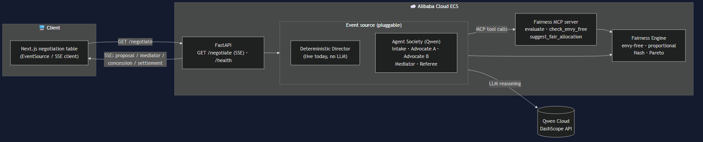

<h1 align="center">⚖️ Arbiter</h1>

<p align="center">
  <b>Every side of a dispute gets its own AI advocate.</b><br/>
  They negotiate a <i>provably fair</i> settlement in under a minute — and Arbiter shows the game-theory math that proves it.
</p>

<p align="center">
  <a href="#license"></a>
  
  
</p>

---

> Built for the **Global AI Hackathon Series with Qwen Cloud** — **Track 3: Agent Society**.

## The problem

High-stakes splits — cofounders dividing equity, families dividing an estate, partners
dividing assets — are slow, expensive, and feel unfair because each side only sees its own
perspective. A single "neutral AI" that dictates a verdict isn't trusted: there's no advocacy
and no proof the outcome is fair.

## The idea

Arbiter is a **society of negotiating agents**:

- 🧑‍⚖️ **Advocate agents** — one per party, each holding that party's *private* valuations,
  fighting to maximize *their* side within honesty + fairness rules.
- 🤝 **Mediator agent** — runs structured negotiation rounds, surfaces contested items,
  breaks deadlocks, steers toward the best joint outcome.
- 📐 **Fairness Engine** — a deterministic, unit-tested module (exposed over **MCP**) that
  scores every proposal on real fair-division criteria: **envy-freeness, proportionality,
  Nash welfare, Pareto-efficiency**. The agents argue; the math adjudicates.
- ✅ **Referee agent** — certifies the final deal and writes each party's personalized rationale.

The result is a **Settlement Agreement** with a fairness certificate and a full audit log —
and, measurably, a fairer outcome than a single agent dictating a verdict.

## Why it's different

- **Real opposing objectives** → authentic negotiation, not theatrical debate.
- **Math-adjudicated conflict resolution** → trust comes from proofs, not vibes.
- **A measurable win** → benchmarked against a single-agent baseline on a suite of disputes.

## Architecture



Three tiers: a **Next.js** frontend, a **FastAPI** negotiation service (deployed on
Alibaba Cloud), and a deterministic **Fairness Engine** exposed both as a library and
as an **MCP server**. The negotiation runs on **Qwen** via DashScope. Full write-up in
[docs/architecture.md](docs/architecture.md); design rationale in the
[spec](docs/superpowers/specs/2026-06-30-arbiter-design.md).

**Tech:** Python · FastAPI (SSE) · Qwen / DashScope (Alibaba Cloud) · Model Context
Protocol · LangGraph · Next.js 16 + Tailwind v4 + Framer Motion · pytest + ruff.

## Getting started

**Backend** (Python 3.11+):

```bash
cd backend
python -m venv .venv && . .venv/Scripts/activate   # Windows; use bin/activate on macOS/Linux
pip install -e ".[dev]"
pytest                                              # run the test suite
uvicorn arbiter.api:app --port 8000                 # start the API (SSE at /negotiate)
```

**Frontend** (Node 20+):

```bash
cd frontend
npm install
npm run dev                                         # http://localhost:3000
```

Open the app and click **Convene the table**. With the backend running it streams the
live negotiation over SSE; without it, a built-in demo plays. Configure the API URL with
`NEXT_PUBLIC_API_URL` (defaults to `http://localhost:8000`).

**Extras:**

```bash
cd backend
python scripts/benchmark.py            # fairness benchmark table + chart
python -m arbiter.mcp_server           # run the Fairness Engine as an MCP server (stdio)
```

## Status

🚧 Active development for the hackathon (deadline 2026-07-08). **Done:** fairness engine
+ solver + benchmark, MCP server, FastAPI SSE backend with a deterministic negotiation
director, and the full negotiation-table frontend wired live end-to-end. **Next:** the
Qwen agent society (advocates/mediator/referee) behind the same event contract, the
single-agent baseline, and Alibaba Cloud deployment.

## License

[MIT](LICENSE) © 2026 Shub Pereira
