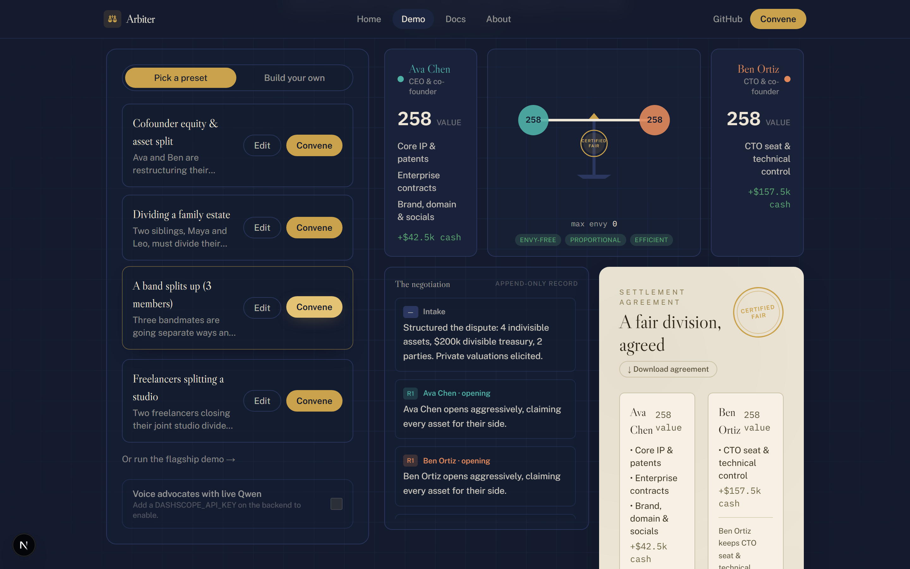
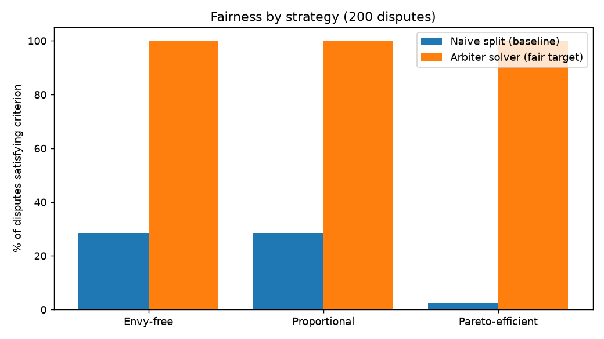

<h1 align="center">⚖️ Arbiter</h1>

<p align="center">
  <b>Every side of a dispute gets its own AI advocate.</b><br/>
  They negotiate a <i>provably fair</i> settlement in under a minute — and Arbiter shows the game-theory math that proves it.
</p>

<p align="center">
  <a href="#license"></a>
  
  
  
</p>

---

> Built for the **Global AI Hackathon Series with Qwen Cloud** — **Track 3: Agent Society**.



## The problem

High-stakes splits — cofounders dividing equity, siblings dividing an estate, a band
dividing its catalog — are slow, expensive, and feel unfair because each side only sees
its own perspective. A single "neutral AI" that dictates a verdict isn't trusted:
there's no advocacy, and no proof the outcome is fair.

## The idea

Arbiter is a **society of negotiating agents**, refereed by math:

- 🧑‍⚖️ **Advocate agents** — one per party (2–6 supported), each holding that party's
  *private* valuations. They make real moves: open with claims, then **demand** the
  asset they value most from whoever holds it.
- 🤝 **Mediator agent** — adjudicates every demand with the fairness engine: **grant**
  it when the demander values the asset more (an efficient trade), **deny** it and
  compensate in cash when they don't. The negotiation *path emerges from the
  valuations* — different disputes negotiate differently.
- 📐 **Fairness Engine** — a deterministic, unit-tested module (exposed over **MCP**)
  that scores every proposal on real fair-division criteria: **envy-freeness,
  proportionality, Nash welfare, Pareto-efficiency**. The agents argue; the math
  adjudicates.
- ✅ **Referee** — certifies the final deal, writes each party's personalized
  rationale, and issues a downloadable **Settlement Agreement**.

## What you can do with it

- **Bring any dispute** — pick a preset (cofounders, estate, a 3-way band split),
  build your own with the structured editor, or *describe it in plain English* and a
  Qwen intake agent structures it.
- **Set red-lines** — lock an asset to a party ("I must keep the house"). The
  mediator honors it, and the engine **honestly reports** the fairness cost: if a
  red-line breaks envy-freeness, the seal reads *best effort*, not *certified fair*.
- **Watch it live** — proposals, demands, denials, and concessions stream over SSE
  onto an animated negotiation table; the balance levels as envy → 0 and a brass
  seal stamps the certificate.

## The measurable win

Judged over 200 seeded disputes, a naive "just split it" division is envy-free only
**28%** of the time (Pareto-efficient: **2%**). Arbiter's engine-refereed negotiation
lands envy-free, proportional, Pareto-efficient outcomes **100%** of the time, at
~60% higher Nash welfare:



Reproduce it: `python backend/scripts/benchmark.py --num-disputes 200`.

## Why it's different

- **Real opposing objectives** → authentic, emergent negotiation — not personas
  politely agreeing, and not a script.
- **Math-adjudicated conflict resolution** → trust comes from proofs, not vibes.
  Every settlement ships with a fairness certificate (or an honest "best effort").
- **A real tool, not a demo** — any parties, any assets, human red-lines,
  downloadable agreements.

## Architecture


Three tiers: a **Next.js** frontend, a **FastAPI** negotiation service (deployed on
Alibaba Cloud ECS), and a deterministic **Fairness Engine** exposed both as a library
and as an **MCP server** — so the negotiating agents call the same audited math over
the open protocol. Qwen (via **Alibaba Cloud DashScope**, see
[`backend/src/arbiter/llm.py`](backend/src/arbiter/llm.py)) voices the advocates and
mediator and powers natural-language intake, with cost-aware model routing per agent
role and graceful fallback — the deterministic engine keeps the product fully
functional even with zero LLM calls. Full write-up in
[docs/architecture.md](docs/architecture.md); deployment guide in
[docs/deploy.md](docs/deploy.md).

**Tech:** Python · FastAPI (SSE) · Qwen / DashScope (Alibaba Cloud) · Model Context
Protocol · Next.js 16 + Tailwind v4 + Framer Motion · pytest + ruff (78 tests).

## Getting started

**Backend** (Python 3.11+):

```bash
cd backend
python -m venv .venv && . .venv/Scripts/activate   # Windows; use bin/activate on macOS/Linux
pip install -e ".[dev]"
pytest                                              # run the test suite
uvicorn arbiter.api:app --port 8000                 # start the API (SSE at /negotiate)
```

**Frontend** (Node 20+):

```bash
cd frontend
npm install
npm run dev                                         # http://localhost:3000
```

Open **/demo**, pick a preset or build a dispute, and click **Convene**. Optional:
set `DASHSCOPE_API_KEY` (see `backend/.env.example`) to enable live Qwen advocates
and the plain-English intake. One-command production run: `docker compose up --build`
(see [docs/deploy.md](docs/deploy.md) for Alibaba Cloud ECS).

**Extras:**

```bash
cd backend
python scripts/benchmark.py            # fairness benchmark table + chart
python -m arbiter.mcp_server           # run the Fairness Engine as an MCP server (stdio)
```

## License

[MIT](LICENSE) © 2026 Shub Pereira
