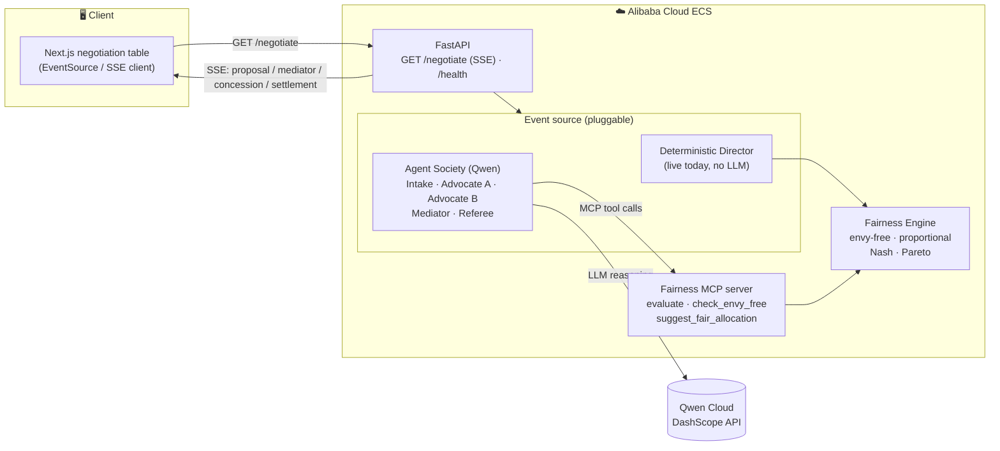

# Arbiter — Architecture

Arbiter is split into three tiers: a **Next.js frontend**, a **FastAPI backend**
(the negotiation service, deployed on Alibaba Cloud), and a deterministic
**Fairness Engine** that adjudicates every proposal — exposed both as a Python
library and as an **MCP server**. The negotiation itself runs on **Qwen** models
via Alibaba Cloud's DashScope API.

## Tiers

**Frontend — `frontend/`**
Next.js 16 + Tailwind v4 + Framer Motion. Opens an `EventSource` to
`/negotiate` and renders each event on the live "negotiation table": advocate
panels, the signature **Balance** (tips toward the heavier side, levels as envy
→ 0), an append-only transcript, and the parchment **Settlement Agreement** with
its fairness certificate. Falls back to a built-in demo stream if the backend is
offline.

**Backend — `backend/src/arbiter/api.py`**
FastAPI streams the negotiation as Server-Sent Events. The **event source is
pluggable** behind one contract:
- **Deterministic Director** (`director.py`) — engine-driven, no LLM. Runs today.
- **Agent Society** (Qwen) — advocates with private valuations negotiate, a
  mediator steers, a referee certifies. Slots in behind the same event contract.

**Fairness Engine — `backend/src/arbiter/fairness.py` + `solver.py`**
Pure, deterministic, unit-tested fair-division math. It is the source of truth
for whether a settlement is fair, and provides the provably-fair target
allocation. Exposed over **MCP** (`mcp_server.py`) so any MCP host — the Qwen
agents, Claude, an IDE — can call it as tools.

## Qwen Cloud usage

- **LLM reasoning** for the advocate, mediator, and referee agents (model routing:
  stronger models for mediation/adjudication, lighter for intake).
- **Function calling / MCP** so agents query the Fairness Engine mid-negotiation
  ("is this trade still envy-free?").
- **Structured outputs** for machine-valid proposals.
- OpenAI-compatible endpoint: `https://dashscope-intl.aliyuncs.com/compatible-mode/v1`.

## Data flow (one negotiation)

1. UI calls `GET /negotiate` and holds the SSE connection open.
2. The event source emits `session_started → intake → proposal/counter ↔ mediator
   → concession → fairness_update → settlement`.
3. Every allocation is scored by the Fairness Engine; the settlement carries a
   `certified_fair` certificate.
4. The UI animates each event; the Balance levels and the seal stamps on
   certification.
